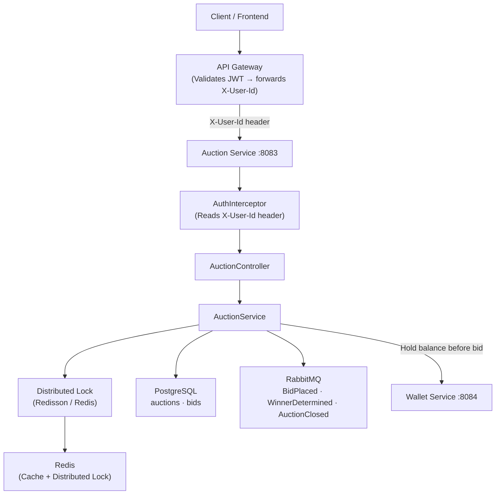
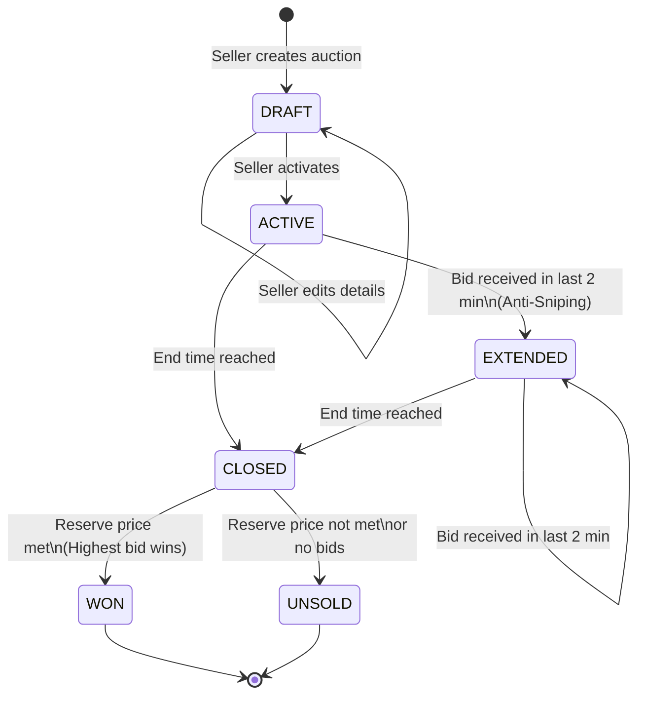

# BidMart — Auction Service


Auction Service is the core microservice of the **BidMart** platform. It manages the full lifecycle of auction items, from creation through bidding to final winner determination, while ensuring fairness through distributed locking and anti-sniping mechanisms.

## Table of Contents

- [Architecture Overview](#architecture-overview)
- [Tech Stack](#tech-stack)
- [Prerequisites](#prerequisites)
- [Local Setup](#local-setup)
- [Auction Lifecycle](#auction-lifecycle)
- [API Reference](#api-reference)
- [Postman Collection](#postman-collection)
- [Swagger & Monitoring Links](#swagger--monitoring-links)
- [Running Tests](#running-tests)
- [CI/CD](#cicd)

## Architecture Overview



### Key Design Decisions

| Concern | Solution |
|---|---|
| **Concurrency / Race Conditions** | Redisson Distributed Lock per auction ID, only one bid processed at a time |
| **Anti-Sniping** | Bids within 2 min of end time auto-extend auction by 2 minutes (`ACTIVE` -> `EXTENDED`) |
| **Async Communication** | RabbitMQ events notify Wallet, Notification, and Catalog services asynchronously |
| **Caching** | Spring Cache + Redis caches auction details and bid history to reduce DB load |
| **Authentication** | `AuthInterceptor` reads `X-User-Id` header forwarded by API Gateway |

## Tech Stack

| Layer | Technology |
|---|---|
| Language | Java 21 |
| Framework | Spring Boot 3.5 |
| Database | PostgreSQL (Neon serverless) |
| ORM | Spring Data JPA + Hibernate |
| Migrations | Flyway |
| Message Broker | RabbitMQ (CloudAMQP) |
| Cache / Distributed Lock | Redis (Upstash) via Redisson |
| API Documentation | SpringDoc OpenAPI (Swagger UI) |
| Metrics | Micrometer + Prometheus |
| Test | JUnit 5, Mockito, H2 (in-memory) |
| CI/CD | GitHub Actions + SonarCloud |

## Prerequisites

- **JDK 21** [Download](https://adoptium.net/)
- **PostgreSQL 14+** Local instance or [Neon](https://neon.tech) (cloud)
- **RabbitMQ 3.12+** Local instance or [CloudAMQP](https://cloudamqp.com) (cloud)
- **Redis 7+** Local instance or [Upstash](https://upstash.com) (cloud, use `rediss://` for TLS)
- **Gradle 8+** (wrapper included, no manual install needed)

## Local Setup

### 1. Clone the Repository

```bash
git clone https://github.com/advprog-2026-B15-project/bidmart-auction.git
cd bidmart-auction
```

### 2. Configure Environment Variables

Copy the example environment file and fill in your credentials:

```bash
cp .env.example .env
# Edit .env with your local or cloud database/broker credentials
```

| Variable | Required | Description |
|---|---|---|
| `JDBC_DATABASE_URL` | Yes | Full PostgreSQL JDBC URL |
| `JDBC_DATABASE_USERNAME` | Yes | Database username |
| `JDBC_DATABASE_PASSWORD` | Yes | Database password |
| `RABBITMQ_HOST` | Yes | RabbitMQ hostname |
| `RABBITMQ_PORT` | Yes | RabbitMQ port (`5671` for SSL, `5672` otherwise) |
| `RABBITMQ_USERNAME` | Yes | RabbitMQ username |
| `RABBITMQ_PASSWORD` | Yes | RabbitMQ password |
| `RABBITMQ_VHOST` | Yes | RabbitMQ virtual host |
| `RABBITMQ_SSL_ENABLED` | No | Set `true` for CloudAMQP |
| `REDIS_URL` | Yes | Redis URL (use `rediss://` for Upstash TLS) |
| `WALLET_SERVICE_URL` | Yes | Internal URL to Wallet Service (e.g., `http://bidmart-wallet:8084`) |

### 3. Run the Application

```bash
./gradlew bootRun
```

The application will start on **`http://localhost:8083`**.

> **Note:** On first startup, `DataSeeder` automatically seeds 50 sample auctions for local testing. This only runs when the `test` Spring profile is NOT active.

## Auction Lifecycle



| Status | Description | Allowed Operations |
|---|---|---|
| `DRAFT` | Newly created, not yet public | Seller can edit details, activate |
| `ACTIVE` | Open for bidding | Buyers can place bids |
| `EXTENDED` | Extended due to anti-sniping rule | Buyers can still place bids |
| `CLOSED` | Time expired, evaluating winner | System transitions to WON or UNSOLD |
| `WON` | Reserve price met, winner determined | Read-only |
| `UNSOLD` | Reserve price not met or no bids | Read-only |

> **Note:** Winner is determined by querying the highest bid at the time of closure. The transition `CLOSED -> WON/UNSOLD` is handled automatically by the `AuctionClosingScheduler`.

## API Reference

All endpoints are prefixed with `/api/auctions`. Authentication uses the `X-User-Id` header, which is set by the API Gateway. For direct testing (via Postman without a gateway), pass it manually.

### Endpoints

| Method | Endpoint | Auth Required | Description |
|---|---|---|---|
| `GET` | `/api/auctions` | No | List all auctions (with pagination & filtering) |
| `GET` | `/api/auctions/{id}` | No | Get auction detail |
| `GET` | `/api/auctions/{id}/bids` | No | Get bid history for an auction |
| `GET` | `/api/auctions/{id}/stream` | No | Subscribe to live bid updates (SSE) |
| `POST` | `/api/auctions` | Yes | Create a new auction (status: DRAFT) |
| `PATCH` | `/api/auctions/{id}` | Yes (Seller only) | Edit a DRAFT auction's details |
| `PATCH` | `/api/auctions/{id}/activate` | Yes (Seller only) | Activate a DRAFT auction |
| `POST` | `/api/auctions/{id}/bids` | Yes (Buyer only) | Place a bid on an active auction |

### Query Parameters for `GET /api/auctions`

| Parameter | Type | Description |
|---|---|---|
| `status` | `string` | Filter by status: `DRAFT`, `ACTIVE`, `EXTENDED`, `WON`, `UNSOLD`, `CLOSED` |
| `minPrice` | `long` | Minimum current price |
| `maxPrice` | `long` | Maximum current price |
| `page` | `int` | Page number (0-indexed, default: `0`) |
| `size` | `int` | Page size (default: `20`) |
| `sort` | `string` | Sort field (e.g., `currentPrice,desc`) |

## Postman Collection

A ready-to-use Postman collection is located at `postman/BidMart_auction_api.json`.

### Import Instructions

1. Open Postman
2. Click **Import** > **File**
3. Select `postman/BidMart_auction_api.json`
4. Go to **Collections** > **BidMart Auction API** > **Variables**
5. Set the following collection variables:

| Variable | Default Value | Description |
|---|---|---|
| `baseUrl` | `http://localhost:8083` | Base URL of the service |
| `sellerId` | `seller-001` | User ID to use as seller |
| `buyerId` | `buyer-001` | User ID to use as buyer |
| `auctionId` | *(auto-filled)* | Set automatically after "Create Auction" |

### Collection Folders

| Folder | Purpose |
|---|---|
| **Happy Path** | Full flow: Create -> Update Draft -> Activate -> Bid -> View History |
| **Pagination & Filtering** | Test list endpoints with various query params |
| **Validation Errors** | Bid too low, past end time, seller bids own auction |
| **Security / Auth Errors** | Missing header, wrong seller trying to edit |
| **SSE Stream** | Subscribe to real-time bid updates |
| **Observability** | Hit health and metrics endpoints |

> All requests use the `X-User-Id` header. No JWT token is required when testing directly.

## Swagger & Monitoring Links

| Tool | Local URL | Description |
|---|---|---|
| **Swagger UI** | [http://localhost:8083/swagger-ui/index.html](http://localhost:8083/swagger-ui/index.html) | API documentation |
| **OpenAPI JSON** | [http://localhost:8083/v3/api-docs](http://localhost:8083/v3/api-docs) | Raw OpenAPI spec |
| **Health Check** | [http://localhost:8083/actuator/health](http://localhost:8083/actuator/health) | Application health status |
| **Prometheus Metrics** | [http://localhost:8083/actuator/prometheus](http://localhost:8083/actuator/prometheus) | Raw metrics endpoint |
| **Grafana Dashboard** | [http://localhost:3000](http://localhost:3000) | Monitoring dashboard (requires Docker Compose) |

## Running Tests

```bash
# Run all tests
./gradlew clean test

# Run with coverage report
./gradlew clean test jacocoTestReport

# View HTML coverage report
open build/reports/jacocoHtml/index.html

# Run SonarQube analysis (requires SONAR_TOKEN env var)
./gradlew sonar
```

The project enforces a minimum **80% code coverage** on all non-DTO/config classes via Jacoco.

## CI/CD

The repository uses GitHub Actions for automated pipelines:

- **CI (on every push)**: `./gradlew test` -> SonarCloud analysis -> Coverage check
- **CD (on push to `main`)**: Build Docker image -> Deploy to cloud environment

See `.github/workflows/` for pipeline definitions.
