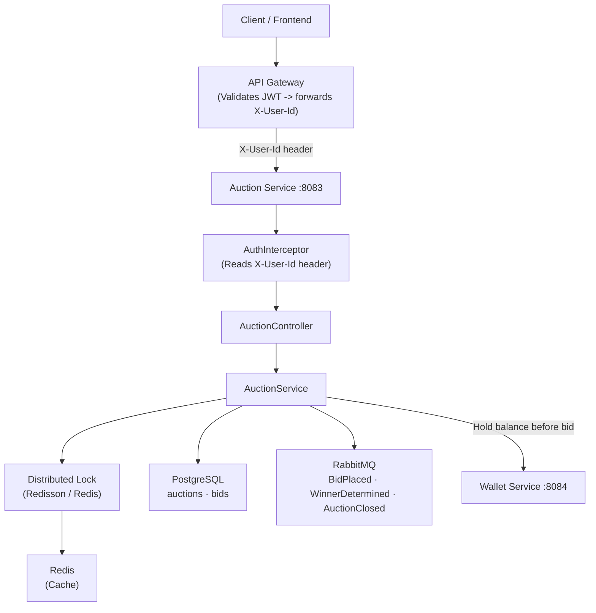

# Architectural Overview

The BidMart Auction Service is built using a **Microservices** architecture with **Spring Boot**. This document explains the main parts of the system and how they work together.

## 1. High-Level Architecture

## 2. Core Features

### A. Distributed Locking
Auctions happen very fast. If two people place a bid at the exact same second, the system might save the wrong price.
- **Solution:** We use a **Redisson Distributed Lock**.
- **How it works:** Before saving a new bid to the database, the system "locks" that specific auction in Redis. If another person tries to bid at the same time, they must wait in line (up to 5 seconds) until the lock is opened. This makes sure the final price is 100% correct.

### B. Two-Level Caching
To prevent the database from crashing when an auction becomes very popular:
1. **Read-Through:** When someone opens the bid history for the first time, we get the data from the database and save it in Redis. We save it in a small, simple format called a **DTO**, which is much faster than saving the full database object.
2. **Write-Through:** When a new bid is placed, we immediately pull the history from Redis, add the new bid to the top, and put it back in Redis. This is incredibly fast and keeps the data updated instantly.

### C. Server-Sent Events
Instead of forcing the user's browser to refresh the page every second to check for new bids (which slows down the server), we use SSE.
- The `SseEmitterService` keeps an open connection to every user looking at the auction.
- Whenever a new bid is saved, the server instantly "pushes" the new price to the users' screens.

### D. Asynchronous Events
To make sure the Auction Service is always fast, we don't wait for other services to finish their jobs.
- After an auction closes or a bid is placed, we send a message (an event) to RabbitMQ (CloudAMQP).
- Other services (like the Notification/Booking Service) can listen to these messages and do their work in the background without slowing down the auction.

### E. Multithreading & Async Processing
Closing auctions requires checking the database and sending events. If thousands of auctions close at the same minute, doing it one-by-one would be too slow.
- We configured custom **Thread Pools** (`ThreadPoolTaskExecutor`) in `AsyncConfig`.
- When the `AuctionClosingScheduler` finds expired auctions, it assigns the closing jobs to multiple worker threads. This means the server can close dozens of auctions simultaneously (in parallel), maximizing CPU usage and keeping the system responsive.
