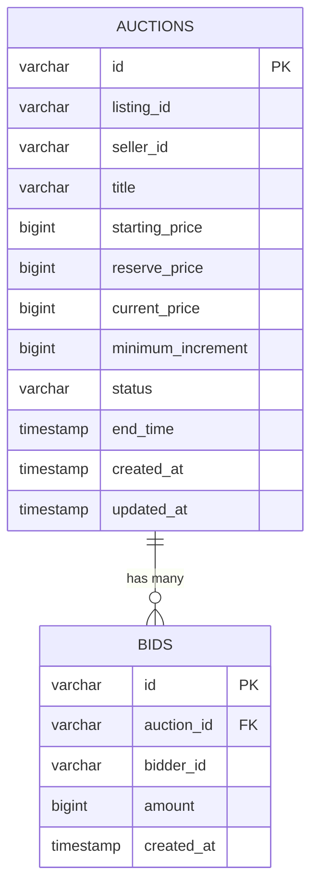

# Database Schema & Migration

The BidMart Auction Service uses **PostgreSQL** as its database and **Flyway** to manage changes to the database structure.

## 1. ERD (Entity Relationship Diagram)

## 2. Indexing Strategy

1. **Single-Column Indexes (Version 1):**
   - `idx_auctions_status` (Helps find auctions based on their status like ACTIVE or CLOSED)
   - `idx_auctions_listing_id` (Helps connect with the Catalog service)
   - `idx_bids_auction_amount` (Helps find the highest bid instantly)
   
2. **Composite Indexes (Version 6):**
   - `idx_auctions_status_end_time` -> This is very important for the background checker that is constantly looking for: "Show me all ACTIVE auctions where the end time has passed".
   - `idx_auctions_status_current_bid` -> This is used when a user searches the website for "Active auctions priced between Rp1000000 and Rp5000000".

## 3. Flyway Migrations
Database change scripts are saved in the `src/main/resources/db/migration` folder. Flyway automatically runs any new scripts when the application starts.
- **V1:** The initial setup (creating the `auctions` and `bids` tables).
- **V2-V5:** Small column fixes.
- **V6:** Adding the new Composite Indexes to make sorting and filtering much faster.
