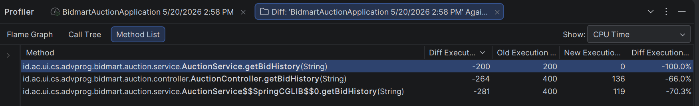
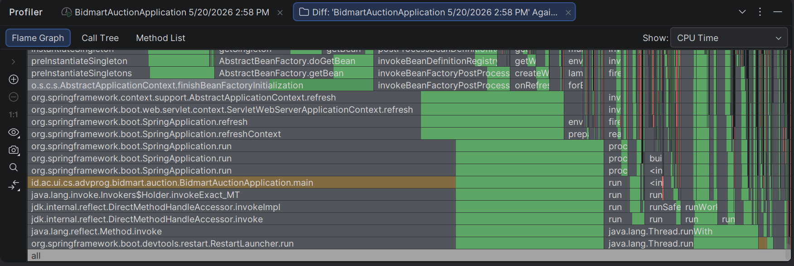

# Profiling & Performance Report

This document shows the performance improvements for the Auction Service, specifically fixing memory and CPU bottlenecks. Tested on **IntelliJ IDEA Profiler**.

## Memory Optimization in `getPreviousBidderId()`

**The Problem:**
To find the second-highest bidder (so the system can return their held money), the application pulled **all** the bids for an auction from the database into Java memory. If an auction had 10,000 bids, it created 10,000 objects in the server's RAM just to find one person. This caused massive Memory Bloat.

**The Solution:**
Changed the code to use a specific database query (`LIMIT 1`). Now, the database does the heavy lifting and only returns exactly 1 object to the Java application.

**The Results:**
The difference is easily visible in the Profiler:
- **CPU Time Drop:** The CPU time for this function dropped drastically from **203 ms** down to just **19 ms**.
- **Memory Allocation Drop:** The memory used plummeted from **2.67 MB** down to a tiny **387.04 KB**. 

*CPU Time drop from 203ms to 19ms*

*Memory Allocation drop from 2.67 MB to 387.04 KB*

## Redis Cache for `getBidHistory()`

**The Objective:**
We implemented Redis Caching to speed up our API. To prove that it actually works, we used the Profiler to compare a **"Cold Hit"** (requesting data when the cache is empty) vs a **"Warm Hit"** (requesting data when it is already saved in Redis).

**The Test Scenario:**
We monitored the `getBidHistory()` endpoint. We tracked the CPU time and the Flame Graph to see what the server was doing behind the scenes during both hits.

**The Results:**
- **Cold Hit (First Request):** The CPU time took **200 ms**.
- **Warm Hit (Subsequent Requests):** The CPU time dropped to **0 ms**! The Flame Graph showed a much cleaner and greener execution path, proving that the heavy database operations were bypassed. The system instantly served the `BidResponse` list directly from Redis.

This proves that our Redis Caching implementation is highly effective and completely removes database overhead for repeated requests.

*CPU Time drop from 200ms (Cold Hit) to 0ms (Warm Hit)*

*Flame Graph showing significantly improved and lighter execution during a Warm Hit*
